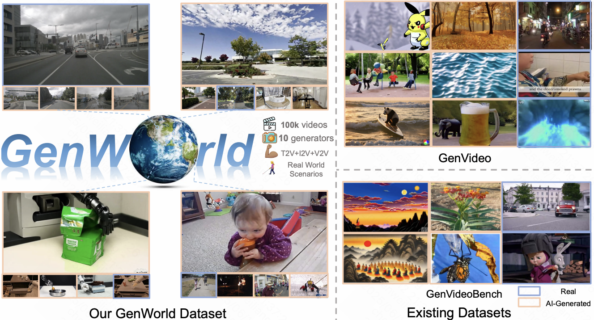

# GenWorld: Towards Detecting AI-generated Real-world Simulation Videos

[**Paper**](https://arxiv.org/abs/2506.10975) | [**Project Page**](https://chen-wl20.github.io/GenWorld/)

> Official implementation of GenWorld: Towards Detecting AI-generated Real-world Simulation Videos

> [Weiliang Chen](https://chen-wl20.github.io/), [Wenzhao Zheng](https://wzzheng.net/)$\dagger$, [Yu Zheng](https://yzheng97.github.io/), [Lei Chen](https://leichenthu.github.io/), [Jie Zhou](https://www.au.tsinghua.edu.cn/info/1078/3126.htm), [Jiwen Lu](https://ivg.au.tsinghua.edu.cn/Jiwen_Lu/), [Yueqi Duan](https://duanyueqi.github.io/)$\ddagger$

$\dagger$ Project leader $\ddagger$ Corresponding author

<p align="center"> All Code will be released soon... 🏗️ 🚧 🔨</p>

Abstract: *The flourishing of video generation technologies has endangered the credibility of real-world information and intensified the demand for AI-generated video detectors. Despite some progress, the lack of high-quality real-world datasets hinders the development of trustworthy detectors. In this paper, we propose **GenWorld**, a large-scale, high-quality, and real-world simulation dataset for AI-generated video detection. GenWorld features the following characteristics: (1) Real-world Simulation: GenWorld focuses on videos that replicate real-world scenarios, which have a significant impact due to their realism and potential influence; (2) High Quality: GenWorld employs multiple state-of-the-art video generation models to provide realistic and high-quality forged videos; (3) Cross-prompt Diversity: GenWorld includes videos generated from diverse generators and various prompt modalities (e.g., text, image, video), offering the potential to learn more generalizable forensic features. We analyze existing methods and find they fail to detect high-quality videos generated by world models (i.e., Cosmos), revealing potential drawbacks of ignoring real-world clues. To address this, we propose a simple yet effective model, SpannDetector, to leverage multi-view consistency as a strong criterion for real-world AI-generated video detection. Experiments show that our method achieves superior results, highlighting a promising direction for explainable AI-generated video detection based on physical plausibility. We believe that GenWorld will advance the field of AI-generated video detection.*

<p align="center">
    
</p>


## Acknowledgement


## BibTeX

```

```
